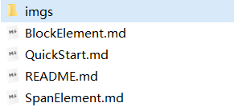

## 检索

[链接](#链接)：链接到其他文件，其他标题，或者其他网址

[链接网址](#链接网址)

[相对路径](#相对路径)：学会链接的必要知识

[链接当前目录文件](#链接当前目录文件)

[链接其他目录文件](#链接其他目录文件)

[链接某一个标题](#链接某一个标题)

[链接到某一个文件的某一个标题](#链接到某一个文件的某一个标题)

[插入图片](#插入图片)

[斜体](#斜体)

[加强（加粗）](#加强（加粗）)

[符号指示](#符号指示)：像这样，`就这样`

[删除线](#删除线)

---

## 链接

链接可以指：

* 指向一个网址，比如：[github](github.com)
* 可以指向另一个文件，比如：[快速开始指南](QuickStart.md)
* 可以指向这个文件的某一个标题，比如：[插入图片](#图片)
* 甚至可以指向另一个文件的某一个标题，比如指向README文件中的[如何使用](README.md#如何使用)

这些链接都有着统一的格式：

```markdown
[需要创建链接的文字](链接地址)
```

链接文字是没有限制的，所以上面四种链接的不同，在于链接地址的不同。
### 链接网址

如果指向一个网址，直接在小括号中直接输入网址就可以了

比如第一个，指向一个网址，[github](github.com)

```markdown
[github](www.github.com)
```

后面的三种，需要使用到路径，一般是分为绝对路径和相对路径的。

**相对路径，对于文件迁移来说更加友好**

#### 相对路径

相对路径，需要找一个参照物，来进行相对比较。这个参照物就是当前文件。

比如，我们这个文件叫`SpanElement.md`



这就相当于起点，接下来我们要根据指令形式。

##### 链接当前目录文件

如果我让你找README，你可以直接找到。（链接的文件与当前文件在同一个目录下，可以直接输入名称进行链接）。当然，我们也可以使用`./`，这个表示当前目录。

比如第二个，可以指向另一个文件，比如：[快速开始指南](QuickStart.md)

```markdown
[快速开始指南](QuickStart.md)或者[快速开始指南](./QuickStart.md)
```

##### 链接其他目录文件

比如，我们想获取`imgs`文件夹中的`pig01.png`，`/`表示下一级目录。

现在我们站在这里，给我们一个`pig01.png`，我们拿着这个指令，四处张望，没有发现目标。

如果先告诉我们`./imgs`或`imgs`，我们是可以找到`imgs`文件夹的。

然后我们站在`imgs`文件夹面前，发现如果想进去的话，还必须要一把钥匙，这个钥匙就是`/`。当我们进入`imgs`文件夹中，就可以找到`pig01.png`文件了。

所以可以表示为：

```markdown
./imgs/pig01.png或imgs/pig01.png
```

### 链接某一个标题

比如我们想链接上一个小标题，`链接其他目录文件`，只要用在小括号中，在`#`后输入标题的名称就可以了

```markdown
[链接到其他目录](#链接其他目录名称)
```

显示效果：

[链接到其他目录](#链接其他目录名称)

### 链接到某一个文件的某一个标题

只需要先链接到某一文件，然后加上`#`标题就行了。就是进行一个组合，但这种方式，在其他编译器中，不一定有用

比如我们想链接`README.md`文件中的`如何使用`。

```markdown
[如何使用](./README.md#如何使用)或[如何使用](README.md#如何使用)
```

显示效果：

[如何使用](./README.md#如何使用)

## 插入图片

插入图片，是建立在链接的基础上的。

在链接的语法基础前，加上`!`进行区分即可。

```markdown


```

显示效果：


## 斜体

在文字的两端输入`*`或`_`，可以使文字变成斜体

```markdown
*我要斜了*（推荐，不用切换中英文，适用面更广）
_看我斜了_
```

显示效果：

*我要斜了*
_看我斜了_

## 加强（加粗）

在文字的两端输入`**`或`__`，可以使文字变成斜体

```markdown
**我要粗了**（推荐，不用切换中英文，适用面更广）
__看我粗了__
```

显示效果：

**我要粗了**
__看我粗了__

## 符号指示

当我们需要强调一个符号或者一个函数的时候，可以在符号或者函数的两端使用`。

```markdown
`看我不一样了`
```

显示效果：

`看我不一样了`

## 删除线

在文字的两端输入`~~`，可以在文字上添加删除线

```markdown
~~我被删除了~~
```

显示效果：

~~我被删除了~~


